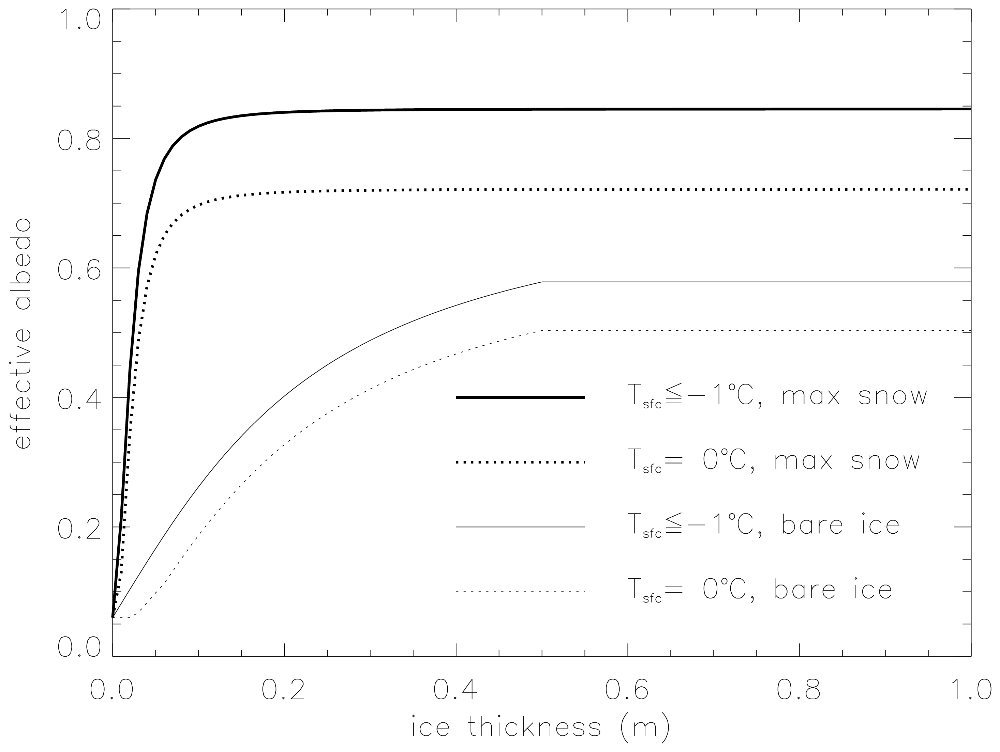

:tocdepth: 3

.. _thermo:

Thermodynamics
==============

The current Icepack version includes three thermodynamics
options, the "zero-layer" thermodynamics of :cite:`Semtner76`
(``ktherm`` = 0), the Bitz and Lipscomb model :cite:`Bitz99`
(``ktherm`` = 1) that assumes a fixed salinity profile, and a "mushy"
formulation (``ktherm`` = 2) in which salinity evolves
:cite:`Turner13`. For each thickness category, Icepack computes
changes in the ice and snow thickness and vertical temperature profile
resulting from radiative, turbulent, and conductive heat fluxes. The ice
has a temperature-dependent specific heat to simulate the effect of
brine pocket melting and freezing, for ``ktherm`` = 1 and 2.

Each thickness category :math:`n` in each grid cell is treated as a
horizontally uniform column with ice thickness
:math:`h_{in} = v_{in}/a_{in}` and snow thickness
:math:`h_{sn} = v_{sn}/a_{in}`. (Henceforth we omit the category
index \ :math:`n`.) Each column is divided into :math:`N_i` ice layers
of thickness :math:`\Delta h_i = h_i/N_i` and :math:`N_s` snow layers of
thickness :math:`\Delta h_s = h_s/N_s`. The surface temperature (i.e.,
the temperature of ice or snow at the interface with the atmosphere) is
:math:`T_{sf}`, which cannot exceed :math:`0^{\circ}C`. The temperature at the
midpoint of the snow layer is :math:`T_s`, and the midpoint ice layer
temperatures are :math:`T_{ik}`, where :math:`k` ranges from 1 to
:math:`N_i`. The temperature at the bottom of the ice is held at
:math:`T_f`, the freezing temperature of the ocean mixed layer. All
temperatures are in degrees Celsius unless stated otherwise.

Each ice layer has an enthalpy :math:`q_{ik}`, defined as the negative
of the energy required to melt a unit volume of ice and raise its
temperature to :math:`0^{\circ}C`. Because of internal melting and freezing in brine
pockets, the ice enthalpy depends on the brine pocket volume and is a
function of temperature and salinity. We can also define a snow enthalpy
:math:`q_s`, which depends on temperature alone.

Given surface forcing at the atmosphere–ice and ice–ocean interfaces
along with the ice and snow thicknesses and temperatures/enthalpies at
time :math:`m`, the thermodynamic model advances these quantities to
time :math:`m+1` (``ktherm`` = 2 also advances salinity). The calculation
proceeds in two steps. First we solve a set of equations for the new
temperatures, as discussed in the :ref:`thermo-temp` section. Then we
compute the melting, if any, of ice or snow at the top surface, and the
growth or melting of ice at the bottom surface, as described in
the :ref:`thermo-growth` section. We begin by describing the melt ponds and surface
forcing parameterizations, which are closely related to the ice and snow
surface temperatures.

.. _ponds:

Melt ponds
----------

Three explicit melt pond parameterizations are available in Icepack, and
all must use the delta-Eddington radiation scheme, described below. The
ccsm3 shortwave parameterization incorporates melt ponds
implicitly by adjusting the albedo based on surface conditions.

For each of the three explicit parameterizations, a volume
:math:`\Delta V_{melt}` of melt water produced on a given category may
be added to the melt pond liquid volume:

.. math:: 
   \Delta V_{melt} = {r\over\rho_w} \left({\rho_{i}}\Delta h_{i} + {\rho_{s}}\Delta h_{s} + F_{rain}{\Delta t}\right) a_i,
   :label: meltvol

where

.. math:: 
   r = r_{min} + \left(r_{max} - r_{min}\right) a_i
   :label: melt-retention

is the fraction of the total melt water available that is added to the
ponds, :math:`\rho_i` and :math:`\rho_s` are ice and snow densities,
:math:`\Delta h_i` and :math:`\Delta h_s` are the thicknesses of ice and
snow that melted, and :math:`F_{rain}` is the rainfall rate. Namelist
parameters are set for the level-ice (``tr_pond_lvl``) parameterization;
in the cesm and topo pond schemes the standard values of :math:`r_{max}`
and :math:`r_{min}` are 0.7 and 0.15, respectively.

Radiatively, the surface of an ice category is divided into fractions of
snow, pond and bare ice. In these melt pond schemes, the actual pond
area and depth are maintained throughout the simulation according to the
physical processes acting on it. However, snow on the sea ice and pond
ice may shield the pond and ice below from solar radiation. These
processes do not alter the actual pond volume; instead they are used to
define an "effective pond fraction" (and likewise, effective pond depth,
snow fraction and snow depth) used only for the shortwave radiation
calculation.

In addition to the physical processes discussed below, tracer equations
and definitions for melt ponds are also described in
the :ref:`tracers` section.

CESM formulation (``tr_pond_cesm`` = true)
~~~~~~~~~~~~~~~~~~~~~~~~~~~~~~~~~~~~~~~~~~

Melt pond area and thickness tracers are carried on each ice thickness
category as in the :ref:`tracers` section. Defined simply as the product
of pond area, :math:`a_p`, and depth, :math:`h_p`, the melt pond volume,
:math:`V_{p}`, grows through addition of ice or snow melt water or rain
water, and shrinks when the ice surface temperature becomes cold,

.. math::
   \begin{aligned}
   {\rm pond \ growth:\ } \ V_{p}^\prime &= V_{p}(t) +\Delta V_{melt} , \\
   {\rm pond \ contraction:\ } \ V_{p}(t+\Delta t) &= V_{p}^\prime\exp\left[r_2\left( {\max\left(T_p-T_{sfc}, 0\right) \over T_p}\right)\right], \end{aligned}
   :label: meltpond-cesm

where :math:`dh_{i}` and :math:`dh_{s}` represent ice and snow melt at
the top surface of each thickness category and :math:`r_2=0.01`. Here,
:math:`T_p` is a reference temperature equal to :math:`-2^\circ`\ C.
Pond depth is assumed to be a linear function of the pond fraction
(:math:`h_p=\delta_p a_p`) and is limited by the category ice thickness
(:math:`h_p \le 0.9 h_i`). The pond shape (``pndaspect``)
:math:`\delta_p = 0.8` in the standard CESM pond configuration. The area
and thickness are computed according to the assumed pond shape, and the
pond area is then reduced in the presence of snow for the radiation
calculation. Ponds are allowed only on ice at least 1 cm thick. This
formulation differs slightly from that documented in
:cite:`Holland12`.

Topographic formulation (``tr_pond_topo`` = true)
~~~~~~~~~~~~~~~~~~~~~~~~~~~~~~~~~~~~~~~~~~~~~~~~~

The principle concept of this scheme is that melt water runs downhill
under the influence of gravity and collects on sea ice with increasing
surface height starting at the lowest height
:cite:`Flocco07,Flocco10,Flocco12`. Thus, the topography of the
ice cover plays a crucial role in determining the melt pond cover.
However, Icepack does not explicitly represent the topography of sea ice.
Therefore, we split the existing ice thickness distribution function
into a surface height and basal depth distribution assuming that each
sea ice thickness category is in hydrostatic equilibrium at the
beginning of the melt season. We then calculate the position of sea
level assuming that the ice in the whole grid cell is rigid and in
hydrostatic equilibrium. 

.. _fig-topo:

.. figure:: ./figures/topo.png
   :align: center
   :scale: 75%

   *Melt Ponds*

Figure :ref:`fig-topo` illustrates (a) Schematic illustration of the relationship between the height of the pond surface :math:`h_{pnd,tot}`, the volume of water
:math:`V_{Pk}` required to completely fill up to category :math:`k`, the
volume of water :math:`V_{P} - V_{Pk}`, and the depth to which this
fills category :math:`k + 1`. Ice and snow areas :math:`a_i` and
:math:`a_s` are also depicted. The volume calculation takes account of
the presence of snow, which may be partially or completely saturated.
(b) Schematic illustration indicating pond surface height
:math:`h_{pnd,tot}` and sea level :math:`h_{sl}` measured with respect
to the thinnest surface height category :math:`h_{i1}`, the submerged
portion of the floe :math:`h_{sub}`, and hydraulic head :math:`\Delta H`
. A positive hydraulic head (pond surface above sea level) will flush
melt water through the sea ice into the ocean; a negative hydraulic head
can drive percolation of sea water onto the ice surface. Here,
:math:`\alpha=0.6` and :math:`\beta=0.4` are the surface height and
basal depth distribution fractions. The height of the steps is the
height of the ice above the reference level, and the width of the steps
is the area of ice of that height. The illustration does not imply a
particular assumed topography, rather it is assumed that all thickness
categories are present at the sub-grid scale so that water will always
flow to the lowest surface height class.

Once a volume of water is produced from ice and snow melting, we
calculate the number of ice categories covered by water. At each time
step, we construct a list of volumes of water
:math:`\{V_{P1}, V_{P2}, . . . V_{P,k-1}, V_{Pk},`
:math:`V_{P,k+1}, . . . \}`, where :math:`V_{Pk}` is the volume of water
required to completely cover the ice and snow in the surface height
categories from :math:`i = 1` to :math:`i = k`. The volume
:math:`V_{Pk}` is defined so that if the volume of water :math:`V_{P}`
is such that :math:`V_{Pk} < V_{P} < V_{P,k+1}` then the snow and ice in
categories :math:`n = 1` to :math:`n = k + 1` are covered in melt
water. Figure :ref:`fig-topo` (a) depicts the areas covered in melt water and
saturated snow on the surface height (rather than thickness) categories
:math:`h_{top,k}`. Note in the code, we assume that
:math:`h_{top,n}/h_{in} = 0.6` (an arbitrary choice). The fractional
area of the :math:`n`\ th category covered in snow is :math:`a_{sn}`.
The volume :math:`V_{P1}`, which is the region with vertical hatching,
is the volume of water required to completely fill the first
thickness category, so that any extra melt water must occupy the second
thickness category, and it is given by the expression

.. math::
   V_{P1} = a_{i1} (h_{top,2}-h_{top,1}) - a_{s1} a_{i1} h_{s1} (1-V_{sw}),
   :label: topo-vol1

where :math:`V_{sw}` is the fraction of the snow volume that can be
occupied by water, and :math:`h_{s1}` is the snow depth on ice height
class 1. In a similar way, the volume required to fill the first and
second surface categories, :math:`V_{P2}`, is given by

.. math::
   V_{P2} = a_{i1} (h_{top,3}-h_{top,2}) + a_{i2} (h_{top,3}-h_{top,2}) - a_{s2} a_{i2} h_{s2} (1-V_{sw}) + V_{P1}.
   :label: topo-vol2

The general expression for volume :math:`V_{Pk}` is given by

.. math::
   V_{Pk} = \sum^k_{m=0} a_{im} (h_{top,k+1}-h_{top,k}) - a_{sk} a_{ik} h_{sk} (1-V_{sw})
             + \sum^{k-1}_{m=0} V_{Pm}.
   :label: topo-vol

(Note that we have implicitly assumed that
:math:`h_{si} < h_{top,k+1} - h_{top,k}` for all :math:`k`.) No melt
water can be stored on the thickest ice thickness category. If the melt
water volume exceeds the volume calculated above, the remaining melt
water is released to the ocean.

At each time step, the pond height above the level of the thinnest
surface height class, that is, the maximum pond depth, is diagnosed from
the list of volumes :math:`V_{Pk}`. In particular, if the total volume
of melt water :math:`V_{P}` is such that
:math:`V_{Pk} < V_{P} < V_{P,k+1}` then the pond height
:math:`h_{pnd,tot}` is

.. math::
   h_{pnd,tot} = h_{par} + h_{top,k} - h_{top,1},
   :label: topo_hpnd_tot

where :math:`h_{par}` is the height of the pond above the level of the
ice in class :math:`k` and partially fills the volume between
:math:`V_{P,k}` and :math:`V_{P,k+1}`. From Figure :ref:`fig-topo` (a) we see
that :math:`h_{top,k} - h_{top,1}` is the height of the melt water,
which has volume :math:`V_{Pk}`, which completely fills the surface
categories up to category :math:`k`. The remaining volume,
:math:`V_{P} - V_{Pk}`, partially fills category :math:`k + 1` to the
height :math:`h_{par}` and there are two cases to consider: either the
snow cover on category :math:`k + 1`, with height :math:`h_{s,k+1}`, is
completely covered in melt water (i.e., :math:`h_{par} > h_{s,k+1}`), or
it is not (i.e., :math:`h_{par} \le h_{s,k+1}`). From conservation of
volume, we see from Figure :ref:`fig-topo` (a) that for an incompletely to
completely saturated snow cover on surface ice class :math:`k + 1`,

.. math::
   \begin{aligned}
   V_{P} - V_{Pk} & = & h_{par} \left( \sum^k_{m=1} a_{ik} + a_{i,k+1}(1-a_{s,k+1}) 
   + a_{i,k+1} a_{s,k+1} V_{sw} \right) 
   & & {\rm for} \hspace{3mm} h_{par} \le h_{s,k+1},\end{aligned}
   :label: topo-satsnow1

and for a saturated snow cover with water on top of the snow on surface
ice class :math:`k + 1`,

.. math::
   \begin{aligned}
   V_{P} - V_{Pk} & = & h_{par} \left( \sum^k_{m=1} a_{ik} + a_{i,k+1}(1-a_{s,k+1}) \right) 
      + a_{i,k+1} a_{s,k+1} V_{sw} h_{s,k+1} \\ 
   & + & a_{i,k+1} a_{s,k+1} (h_{par}-h_{s,k+1})
   & & {\rm for} \hspace{3mm} h_{par} > h_{s,k+1}.\end{aligned}
   :label: topo-satsnow2

As the melting season progresses, not only does melt water accumulate
upon the upper surface of the sea ice, but the sea ice beneath the melt
water becomes more porous owing to a reduction in solid fraction
:cite:`Eicken04`. The hydraulic head of melt water on sea
ice (i.e., its height above sea level) drives flushing of melt water
through the porous sea ice and into the underlying ocean. The mushy
thermodynamics scheme (`ktherm` = 2) handles flushing. For
`ktherm` :math:`\ne 2` we model the vertical flushing rate using Darcy’s
law for flow through a porous medium

.. math::
   w = - \frac{\Pi_v}{\mu} \rho_o g \frac{\Delta H}{h_i},
   :label: topo-darcy

where :math:`w` is the vertical mass flux per unit perpendicular
cross-sectional area (i.e., the vertical component of the Darcy
velocity), :math:`\Pi_v` is the vertical component of the permeability
tensor (assumed to be isotropic in the horizontal), :math:`\mu` is the
viscosity of water, :math:`\rho_o` is the ocean density, :math:`g` is
gravitational acceleration, :math:`\Delta H` is the the hydraulic head,
and :math:`h_i` is the thickness of the ice through which the pond
flushes. As proposed by :cite:`Golden07` the vertical
permeability of sea ice can be calculated from the liquid fraction
:math:`\phi`:

.. math::
   \Pi_v = 3 \times 10^{-8} \phi^3 \rm{m^2}.
   :label: topo-permea

Since the solid fraction varies throughout the depth of the sea ice, so
does the permeability. The rate of vertical drainage is determined by
the lowest (least permeable) layer, corresponding to the highest solid
fraction. From the equations describing sea ice as a mushy layer
:cite:`Feltham06`, the solid fraction is determined by:

.. math::
   \phi = \frac{c_i-S}{c_i-S_{br}(T)},
   :label: topo-solid

where :math:`S` is the bulk salinity of the ice, :math:`S_{br}(T)` is
the concentration of salt in the brine at temperature :math:`T` and
:math:`c_i` is the concentration of salt in the ice crystals (set to
zero).

The hydraulic head is given by the difference in height between the
upper surface of the melt pond :math:`h_{pnd,tot}` and the sea level
:math:`h_{sl}`. The value of the sea level :math:`h_{sl}` is calculated
from

.. math::
   h_{sl} = h_{sub} - 0.4 \sum^{N}_{n=1} a_{in} h_{in} - \beta h_{i1},
   :label: topo-hsl1

where :math:`0.4 \sum^{N}_{n=1} a_{in} h_{i,n}` is the mean thickness
of the basal depth classes, and :math:`h_{sub}` is the depth of the
submerged portion of the floe. Figure :ref:`fig-topo` (b) depicts the
relationship between the hydraulic head and the depths and heights that
appear in Equation :eq:`topo-hsl1`. The depth of the submerged portion
of the floe is determined from hydrostatic equilibrium to be

.. math::
   h_{sub} = \frac{\rho_m}{\rho_w} V_P + \frac{\rho_s}{\rho_w} V_s + \frac{\rho_i}{\rho_w} V_i,
   :label: topo-hsl2

where :math:`\rho_m` is the density of melt water, :math:`V_P` is the
total pond volume, :math:`V_s` is the total snow volume, and :math:`V_i`
is the total ice volume.

When the surface energy balance is negative, a layer of ice is formed at
the upper surface of the ponds. The rate of growth of the ice lid is
given by the Stefan energy budget at the lid-pond interface

.. math::
   \rho_i L_0 \frac{d h_{ipnd}}{dt} = k_i \frac{\partial T_i}{\partial z} - k_p \frac{\partial T_p}{\partial z},
   :label: topo-lid

where :math:`L_0` is the latent heat of fusion of pure ice per unit
volume, :math:`T_i` and :math:`T_p` are the ice surface and pond
temperatures, and :math:`k_i` and :math:`k_p` are the thermal
conductivity of the ice lid and pond respectively. The second term on
the right hand-side is close to zero since the pond is almost uniformly
at the freezing temperature :cite:`Taylor04`. Approximating the
temperature gradient in the ice lid as linear, the Stefan condition
yields the classic Stefan solution for ice lid depth

.. math::
   h_{ipnd} = \sqrt{\frac{2k_i}{\rho_s L}\Delta T_i t},
   :label: topo-stefan

where :math:`\Delta T` is the temperature difference between the top
and the bottom of the lid. Depending on the surface flux conditions the
ice lid can grow, partially melt, or melt completely. Provided that the
ice lid is thinner than a critical lid depth (1 cm is suggested) then
the pond is regarded as effective, i.e. the pond affects the optical
properties of the ice cover. Effective pond area and pond depth for each
thickness category are passed to the radiation scheme for calculating
albedo. Note that once the ice lid has exceeded the critical thickness,
snow may accumulate on the lid causing a substantial increase in albedo.
In the current CICE model, melt ponds only affect the thermodynamics of
the ice through the albedo. To conserve energy, the ice lid is dismissed
once the pond is completely refrozen.

As the sea ice area shrinks due to melting and ridging, the pond volume
over the lost area is released to the ocean immediately. In
:cite:`Flocco10`, the pond volume was carried as an ice area
tracer, but in :cite:`Flocco12` and here, pond area and
thickness are carried as separate tracers, as in
the :ref:`tracers` section.

Unlike the cesm and level-ice melt pond schemes, the liquid pond water
in the topo parameterization is not necessarily virtual; it can be
withheld from being passed to the ocean model until the ponds drain by
setting the namelist variable ``l_mpond_fresh`` = .true. The refrozen pond
lids are still virtual. Extra code needed to track and enforce
conservation of water has been added to **icepack\_itd.F90** (subroutine
*zap\_small\_areas*), **icepack\_mechred.F90** (subroutine *ridge\_shift*),
**icepack\_therm\_itd.F90** (subroutines *linear\_itd* and *lateral\_melt*),
and **icepack\_therm\_vertical.F90** (subroutine *thermo\_vertical*), along
with global diagnostics in **icedrv\_diagnostics.F90**.

Level-ice formulation (``tr_pond_lvl`` = true)
~~~~~~~~~~~~~~~~~~~~~~~~~~~~~~~~~~~~~~~~~~~~~~

This meltpond parameterization represents a combination of ideas from
the empirical CESM melt pond scheme and the topo approach, and is
documented in :cite:`Hunke13`. The ponds evolve according to
physically based process descriptions, assuming a thickness-area ratio
for changes in pond volume. A novel aspect of the new scheme is that the
ponds are carried as tracers on the level (undeformed) ice area of each
thickness category, thus limiting their spatial extent based on the
simulated sea ice topography. This limiting is meant to approximate the
horizontal drainage of melt water into depressions in ice floes. (The
primary difference between the level-ice and topo meltpond
parameterizations lies in how sea ice topography is taken into account
when determining the areal coverage of ponds.) Infiltration of the snow
by melt water postpones the appearance of ponds and the subsequent
acceleration of melting through albedo feedback, while snow on top of
refrozen pond ice also reduces the ponds’ effect on the radiation
budget.

Melt pond processes, described in more detail below, include addition of
liquid water from rain, melting snow and melting surface ice, drainage
of pond water when its weight pushes the ice surface below sea level or
when the ice interior becomes permeable, and refreezing of the pond
water. If snow falls after a layer of ice has formed on the ponds, the
snow may block sunlight from reaching the ponds below. When melt water
forms with snow still on the ice, the water is assumed to infiltrate the
snow. If there is enough water to fill the air spaces within the
snowpack, then the pond becomes visible above the snow, thus decreasing
the albedo and ultimately causing the snow to melt faster. The albedo
also decreases as snow depth decreases, and thus a thin layer of snow
remaining above a pond-saturated layer of snow will have a lower albedo
than if the melt water were not present.

The level-ice formulation assumes a thickness-area ratio for *changes*
in pond volume, while the CESM scheme assumes this ratio for the total
pond volume. Pond volume changes are distributed as changes to the area
and to the depth of the ponds using an assumed aspect ratio, or shape,
given by the parameter :math:`\delta_p` (``pndaspect``),
:math:`\delta_p = {\Delta h_p / \Delta a_{p}}` and
:math:`\Delta V = \Delta h_p \Delta a_{p} = \delta_p\Delta a_p^2  = \Delta h_{p}^2/\delta_p`.
Here, :math:`a_{p} = a_{pnd} a_{lvl}`, the mean pond area over the ice.

Given the ice velocity :math:`\bf u`, conservation equations for level
ice fraction :math:`a_{lvl}a_i`, pond area fraction
:math:`a_{pnd}a_{lvl}a_i`, pond volume :math:`h_{pnd}a_{pnd}a_{lvl}a_i`
and pond ice volume :math:`h_{ipnd}a_{pnd}a_{lvl}a_i` are

.. math::
   {\partial\over\partial t} (a_{lvl}a_{i}) + \nabla \cdot (a_{lvl}a_{i} {\bf u}) = 0,
   :label: transport-lvl

.. math::
   {\partial\over\partial t} (a_{pnd}a_{lvl}a_{i}) + \nabla \cdot (a_{pnd}a_{lvl}a_{i} {\bf u}) = 0,
   :label: transport-apnd-lvl   

.. math::
   {\partial\over\partial t} (h_{pnd}a_{pnd}a_{lvl}a_{i}) + \nabla \cdot (h_{pnd}a_{pnd}a_{lvl}a_{i} {\bf u}) = 0,
   :label: transport-hpnd-lvl

.. math::
   {\partial\over\partial t} (h_{ipnd}a_{pnd}a_{lvl}a_{i}) + \nabla \cdot (h_{ipnd}a_{pnd}a_{lvl}a_{i} {\bf u}) = 0.
   :label: transport-ipnd-lvl

(We have dropped the category subscript here, for clarity.) Equations
:eq:`transport-hpnd-lvl` and :eq:`transport-ipnd-lvl` express
conservation of melt pond volume and pond ice volume, but in this form
highlight that the quantities tracked in the code are the tracers
:math:`h_{pnd}` and :math:`h_{ipnd}`, pond depth and pond ice thickness.
Likewise, the level ice fraction :math:`a_{lvl}` is a tracer on ice area
fraction (Equation :eq:`transport-lvl`), and pond fraction :math:`a_{pnd}` is
a tracer on level ice (Equation :eq:`transport-apnd-lvl`).

*Pond ice.* The ponds are assumed to be well mixed fresh water, and
therefore their temperature is 0\ :math:`^\circ`\ C. If the air
temperature is cold enough, a layer of clear ice may form on top of the
ponds. There are currently three options in the code for refreezing the
pond ice. Only option A tracks the thickness of the lid ice using the
tracer :math:`h_{ipnd}` and includes the radiative effect of snow on top
of the lid.

A. The ``frzpnd`` = ‘hlid’ option uses a Stefan approximation for growth of
fresh ice and is invoked only when :math:`\Delta V_{melt}=0`.

The basic thermodynamic equation governing ice growth is

.. math::
   \rho_i L {\partial h_i\over\partial t} = k_i{\partial T_i\over\partial z} \sim k_i {\Delta T\over h_i}
   :label: Stefanthermo1

assuming a linear temperature profile through the ice thickness
:math:`h_i`. In discrete form, the solution is

.. math::
   \Delta h_i = \left\{ 
   \begin{array}{ll}    {\sqrt{\beta\Delta t}/2} & \mbox {if $h_i=0$} \\
                                   {\beta\Delta t / 2 h_i} & \mbox {if $h_i>0,$} 
   \end{array} \right.
   :label: hi

where

.. math:: 
   \beta = {2 k_i \Delta T \over \rho_i L} .
   :label: beta

When :math:`\Delta V_{melt}>0`, any existing pond ice may also melt. In
this case,

.. math::
   \Delta h_i = -\min\left({\max(F_\circ, 0) \Delta t \over \rho_i L}, h_i\right),
   :label: ipndmelt

where :math:`F_\circ` is the net downward surface flux.

In either case, the change in pond volume associated with growth or melt
of pond ice is

.. math::
   \Delta V_{frz} = -\Delta h_i a_{pnd} a_{lvl} a_i {\rho_i/\rho_0},
   :label: vfrz

where :math:`\rho_0` is the density of fresh water.

B. The ``frzpnd`` = ‘cesm’ option uses the same empirical function as in the
CESM melt pond parameterization.

*Radiative effects.* Freshwater ice that has formed on top of a melt
pond is assumed to be perfectly clear. Snow may accumulate on top of the
pond ice, however, shading the pond and ice below. The depth of the snow
on the pond ice is initialized as :math:`h_{ps}^0 = F_{snow}\Delta t` at
the first snowfall after the pond ice forms. From that time until either
the pond ice or the pond snow disappears, the pond snow depth tracks the
depth of snow on sea ice (:math:`h_s`) using a constant difference
:math:`\Delta`. As :math:`h_s` melts, :math:`h_{ps}=h_s-\Delta` will be
reduced to zero eventually, at which time the pond ice is fully
uncovered and shortwave radiation passes through.

To prevent a sudden change in the shortwave reaching the sea ice (which
can prevent the thermodynamics from converging), thin layers of snow on
pond ice are assumed to be patchy, thus allowing the shortwave flux to
increase gradually as the layer thins. This is done using the same
parameterization for patchy snow as is used elsewhere in Icepack, but with
its own parameter :math:`h_{s1}`:

.. math:: 
   a_{pnd}^{eff} = \left(1 - \min\left(h_{ps}/h_{s1}, 1\right)\right) a_{pnd} a_{lvl}.
   :label: apndeff

If any of the pond ice melts, the radiative flux allowed to pass through
the ice is reduced by the (roughly) equivalent flux required to melt
that ice. This is accomplished (approximately) with
:math:`a_{pnd}^{eff} = (1-f_{frac})a_{pnd}a_{lvl}`, where (see
Equation :eq:`ipndmelt`)

.. math:: 
   f_{frac} = \min\left(-{\rho_i L\Delta h_i\over F_\circ \Delta t}, 1 \right) .
   :label: snowinf

*Snow infiltration by pond water.* If there is snow on top of the sea
ice, melt water may infiltrate the snow. It is a "virtual process" that
affects the model’s thermodynamics through the input parameters of the
radiation scheme; it does not melt the snow or affect the snow heat
content.

A snow pack is considered saturated when its percentage of liquid water
content is greater or equal to 15% (Sturm and others, 2009). We assume
that if the volume fraction of retained melt water to total liquid
content

.. math:: 
   r_p = {V_p\over V_p + V_s \rho_s / \rho_0} < 0.15,
   :label: snowinf2

then effectively there are no meltponds present, that is,
:math:`a_{pnd}^{eff}=h_{pnd}^{eff}=0`. Otherwise, we
assume that the snowpack is saturated with liquid water.

We assume that all of the liquid water accumulates at the base of the
snow pack and would eventually melt the surrounding snow. Two
configurations are therefore possible, (1) the top of the liquid lies
below the snow surface and (2) the liquid water volume overtops the
snow, and all of the snow is assumed to have melted into the pond. The
volume of void space within the snow that can be filled with liquid melt
water is

.. math:: 
   V_{mx}=h_{mx}a_{p} = {\left(\rho_0-\rho_s\over \rho_0\right)}h_s a_{p},
   :label: volmelt

and we compare :math:`V_p` with :math:`V_{mx}`.

Case 1: For :math:`V_p < V_{mx}`, we define :math:`V_p^{eff}` to
be the volume of void space filled by the volume :math:`V_p` of melt
water: :math:`\rho_0 V_p =  (\rho_0-\rho_s) V_p^{eff},` or in
terms of depths,

.. math:: 
   h_p^{eff} = {\left(\rho_0  \over \rho_0 - \rho_s\right)}h_{pnd}.
   :label: hpndeff

The liquid water under the snow layer is not visible and therefore the
ponds themselves have no direct impact on the radiation
(:math:`a_{pnd}^{eff}=h_{pnd}^{eff}=0`), but the
effective snow thickness used for the radiation scheme is reduced to

.. math:: 
   h_s^{eff} = h_s - h_p^{eff}a_p = h_s - {\rho_0 \over \rho_0 - \rho_s}h_{pnd} a_p.
   :label: hseff

Here, the factor :math:`a_p=a_{pnd}a_{lvl}` averages the reduced snow
depth over the ponds with the full snow depth over the remainder of the
ice; that is, :math:`h_s^{eff} = h_s(1-a_p) + (h_s -h_p^{eff})a_p.`

Case 2: Similarly, for :math:`V_p \ge V_{mx}`, the total mass in the
liquid is :math:`\rho_0 V_p + \rho_s V_s = \rho_0 V_p^{eff},` or

.. math:: 
   h_p^{eff} = {\rho_0 h_{pnd} + \rho_s h_{s} \over \rho_0}.
   :label: hpeff

Thus the effective depth of the pond is the depth of the whole slush
layer :math:`h_p^{eff}`. In this case,
:math:`a_{pnd}^{eff}=a_{pnd}a_{lvl}`.

*Drainage.* A portion :math:`1-r` of the available melt water drains
immediately into the ocean. Once the volume changes described above have
been applied and the resulting pond area and depth calculated, the pond
depth may be further reduced if the top surface of the ice would be
below sea level or if the sea ice becomes permeable.

We require that the sea ice surface remain at or above sea level. If the
weight of the pond water would push the mean ice–snow interface of a
thickness category below sea level, some or all of the pond water is
removed to bring the interface back to sea level via Archimedes’
Principle written in terms of the draft :math:`d`,

.. math:: 
   \rho_i h_i + \rho_s h_s + \rho_0 h_p = \rho_w d \le \rho_w h_i.
   :label: freeboard

There is a separate freeboard calculation in the thermodynamics which
considers only the ice and snow and converts flooded snow to sea ice.
Because the current melt ponds are "virtual" in the sense that they only
have a radiative influence, we do not allow the pond mass to change the
sea ice and snow masses at this time, although this issue may need to be
reconsidered in the future, especially for the Antarctic.

The mushy thermodynamics scheme (`ktherm` = 2) handles flushing.
For `ktherm` :math:`\ne 2`, the permeability of the sea ice is calculated
using the internal ice temperatures :math:`T_i` (computed from the
enthalpies as in the sea ice thermodynamics). The brine salinity and
liquid fraction are given by :cite:`Notz05` [eq 3.6]
:math:`S_{br} = {1/ (10^{-3} - 0.054/T_i)}` and :math:`\phi = S/S_{br}`,
where :math:`S` is the bulk salinity of the combined ice and brine. The
ice is considered permeable if :math:`\phi \ge 0.05` with a permeability
of :math:`p=3\times 10^{-8}\min(\phi^3)` (the minimum being taken over
all of the ice layers). A hydraulic pressure head is computed as
:math:`P=g\rho_w\Delta h` where :math:`\Delta h` is the height of the
pond and sea ice above sea level. Then the volume of water drained is
given by

.. math:: 
   \Delta V_{perm} = -a_{pnd} \min\left(h_{pnd}, {p P d_p \Delta t \over \mu h_i}\right),
   :label: vperm

where :math:`d_p` is a scaling factor (dpscale), and
:math:`\mu=1.79\times 10^{-3}` kg m :math:`^{-1}` s :math:`^{-1}` is the
dynamic viscosity.

*Conservation elsewhere.* When ice ridges and when new ice forms in open
water, the level ice area changes and ponds must be handled
appropriately. For example, when sea ice deforms, some of the level ice
is transformed into ridged ice. We assume that pond water (and ice) on
the portion of level ice that ridges is lost to the ocean. All of the
tracer volumes are altered at this point in the code, even though
:math:`h_{pnd}` and :math:`h_{ipnd}` should not change; compensating
factors in the tracer volumes cancel out (subroutine *ridge\_shift* in
**icepack\_mechred.F90**).

When new ice forms in open water, level ice is added to the existing sea
ice, but the new level ice does not yet have ponds on top of it.
Therefore the fractional coverage of ponds on level ice decreases
(thicknesses are unchanged). This is accomplished in
**icepack\_therm\_itd.F90** (subroutine *add\_new\_ice*) by maintaining the
same mean pond area in a grid cell after the addition of new ice,

.. math:: 
   a_{pnd}^\prime (a_{lvl}+\Delta a_{lvl}) (a_i+\Delta a_i)   = a_{pnd} a_{lvl} a_i,
   :label: apndprime

and solving for the new pond area tracer :math:`a_{pnd}^\prime` given
the newly formed ice area :math:`\Delta a_i = \Delta a_{lvl}`.

.. _sfc-forcing:

Thermodynamic surface forcing balance
-------------------------------------

The net surface energy flux from the atmosphere to the ice (with all
fluxes defined as positive downward) is

.. math::
   F_0 = F_s + F_l + F_{L\downarrow} + F_{L\uparrow} +
            (1-\alpha) (1-i_0) F_{sw},
   :label: f0

where :math:`F_s` is the sensible heat flux, :math:`F_l` is the latent
heat flux, :math:`F_{L\downarrow}` is the incoming longwave flux,
:math:`F_{L\uparrow}` is the outgoing longwave flux, :math:`F_{sw}` is
the incoming shortwave flux, :math:`\alpha` is the shortwave albedo, and
:math:`i_0` is the fraction of absorbed shortwave flux that penetrates
into the ice. The albedo may be altered by the presence of melt ponds.
Each of the explicit melt pond parameterizations (CESM, topo and
level-ice ponds) should be used in conjunction with the Delta-Eddington
shortwave scheme, described below.

Shortwave radiation: Delta-Eddington
~~~~~~~~~~~~~~~~~~~~~~~~~~~~~~~~~~~~

Two methods for computing albedo and shortwave fluxes are available, the
"ccsm3" method, described below, and a multiple scattering
radiative transfer scheme that uses a Delta-Eddington approach.
"Inherent" optical properties (IOPs) for snow and sea ice, such as
extinction coefficient and single scattering albedo, are prescribed
based on physical measurements; reflected, absorbed and transmitted
shortwave radiation ("apparent" optical properties) are then computed
for each snow and ice layer in a self-consistent manner. Absorptive
effects of inclusions in the ice/snow matrix such as dust and algae can
also be included, along with radiative treatment of melt ponds and other
changes in physical properties, for example granularization associated
with snow aging. The Delta-Eddington formulation is described in detail
in :cite:`Briegleb07`. Since publication of this technical paper,
a number of improvements have been made to the Delta-Eddington scheme,
including a surface scattering layer and internal shortwave absorption
for snow, generalization for multiple snow layers and more than four
layers of ice, and updated IOP values.

The namelist parameters ``R_ice`` and ``R_pnd`` adjust the albedo of bare or
ponded ice by the product of the namelist value and one standard
deviation. For example, if ``R_ice`` = 0.1, the albedo increases by
:math:`0.1\sigma`. Similarly, setting ``R_snw`` = 0.1 decreases the snow
grain radius by :math:`0.1\sigma` (thus increasing the albedo). Two
additional tuning parameters are available for this scheme, ``dT_mlt`` and
``rsnw_mlt``. ``dT_mlt`` is the temperature change needed for a change in snow
grain radius from non-melting to melting, and ``rsnw_mlt`` is the maximum
snow grain radius when melting. An absorption coefficient for algae
(``kalg``) may also be set. See :cite:`Briegleb07` for details; the
CESM melt pond and Delta-Eddington parameterizations are further
explained and validated in :cite:`Holland12`.

Shortwave radiation: CCSM3
~~~~~~~~~~~~~~~~~~~~~~~~~~

In the parameterization used in the previous version of the Community
Climate System Model (CCSM3), the albedo depends on the temperature and
thickness of ice and snow and on the spectral distribution of the
incoming solar radiation. Albedo parameters have been chosen to fit
observations from the SHEBA field experiment. For
:math:`T_{sf} < -1^{\circ}C` and :math:`h_i > `\ ``ahmax``, the bare ice
albedo is 0.78 for visible wavelengths (:math:`<700`\ nm) and 0.36 for
near IR wavelengths (:math:`>700`\ nm). As :math:`h_i` decreases from
ahmax to zero, the ice albedo decreases smoothly (using an arctangent
function) to the ocean albedo, 0.06. The ice albedo in both spectral
bands decreases by 0.075 as :math:`T_{sf}` rises from
:math:`-1^{\circ}C` to . The albedo of cold snow (:math:`T_{sf} <
-1^{\circ}C`) is 0.98 for visible wavelengths and 0.70 for near IR
wavelengths. The visible snow albedo decreases by 0.10 and the near IR
albedo by 0.15 as :math:`T_{sf}` increases from :math:`-1^{\circ}C`
to :math:`0^{\circ}C`. The total albedo is an area-weighted average of the ice and snow
albedos, where the fractional snow-covered area is

.. math:: 
   f_{snow} = \frac{h_s}{h_s + h_{snowpatch}},
   :label: snowfrac

and :math:`h_{snowpatch} = 0.02 \ {\mathrm m}`. The envelope
of albedo values is shown in Figure :ref:`fig-albedo`. This albedo
formulation incorporates the effects of melt ponds implicitly; the
explicit melt pond parameterization is not used in this case.

.. _fig-albedo:

 
   *Albedo*

Figure :ref:`fig-albedo` illustrates Albedo as a function of ice thickness and temperature, for the two extrema in snow depth, for the ccsm3 shortwave
option. Maximum snow depth is computed based on Archimedes’ Principle
for the given ice thickness. These curves represent the envelope of
possible albedo values. 

The net absorbed shortwave flux is :math:`F_{swabs} = \sum
(1-\alpha_j) F_{sw\downarrow}`, where the summation is over four
radiative categories (direct and diffuse visible, direct and diffuse
near infrared). The flux penetrating into the ice is :math:`I_0
= i_0 \, F_{swabs}`, where :math:`i_0 = 0.70 \, (1-f_{snow})`
for visible radiation and :math:`i_0 = 0` for near IR. Radiation
penetrating into the ice is attenuated according to Beer’s Law:

.. math::
   I(z) = I_0 \exp(-\kappa_i z),
   :label: Beers-law

where :math:`I(z)` is the shortwave flux that reaches depth :math:`z`
beneath the surface without being absorbed, and :math:`\kappa_i` is the
bulk extinction coefficient for solar radiation in ice, set to
:math:`1.4 \
{\mathrm m^{-1}}` for visible wavelengths :cite:`Ebert95`. A
fraction :math:`\exp(-\kappa_i h_i)` of the penetrating solar radiation
passes through the ice to the ocean
(:math:`F_{sw\Downarrow}`). 

Longwave radiation, turbulent fluxes
~~~~~~~~~~~~~~~~~~~~~~~~~~~~~~~~~~~~

While incoming shortwave and longwave radiation are obtained from the
atmosphere, outgoing longwave radiation and the turbulent heat fluxes
are derived quantities. Outgoing longwave takes the standard blackbody
form, :math:`F_{L\uparrow}=\epsilon\sigma
\left(T_{sf}^{K}\right)^4`, where :math:`\epsilon=0.95` is the
emissivity of snow or ice, :math:`\sigma` is the Stefan-Boltzmann
constant and :math:`T_{sf}^{K}` is the surface temperature in
Kelvin. (The longwave fluxes are partitioned such that
:math:`\epsilon F_{L\downarrow}` is absorbed at the surface, the
remaining :math:`\left(1-\epsilon\right)F_{L\downarrow}` being returned
to the atmosphere via :math:`F_{L\uparrow}`.) The sensible heat flux is
proportional to the difference between air potential temperature and the
surface temperature of the snow or snow-free ice,

.. math:: 
   F_s = C_s \left(\Theta_a - T_{sf}^K\right).
   :label: flux1

:math:`C_s` and :math:`C_l` (below) are nonlinear turbulent heat
transfer coefficients described in the :ref:`atmo` section. Similarly,
the latent heat flux is proportional to the difference between
:math:`Q_a` and the surface saturation specific humidity :math:`Q_{sf}`:

.. math::
   \begin{aligned}
   F_l&=& C_l\left(Q_a - Q_{sf}\right),\\
   Q_{sf}&=&(q_1 / \rho_a)  \exp(-q_2 / T_{sf}^K),\end{aligned}

where :math:`q_1 = 1.16378 \times 10^7 \, \mathrm{kg/m^3}`,
:math:`q_2 =
5897.8 \, \mathrm{K}`, :math:`T_{sf}^K` is the surface temperature in
Kelvin, and :math:`\rho_a` is the surface air density.

The net downward heat flux from the ice to the ocean is given by
:cite:`Maykut95`:

.. math::
   F_{bot} = -\rho_w c_w c_h u_* (T_w - T_f),
   :label: fbot

where :math:`\rho_w` is the density of seawater, :math:`c_w` is the
specific heat of seawater, :math:`c_h = 0.006` is a heat transfer
coefficient, :math:`u_*=\sqrt{\left|\vec{\tau}_w\right|/\rho_w}` is the
friction velocity, and :math:`T_w` is the sea surface temperature. A
minimum value of :math:`u_*` is available; we recommend
:math:`u_{*\min} = 5\times 10^{-4}` m/s, but the optimal value may
depend on the ocean forcing used and can be as low as 0.

:math:`F_{bot}` is limited by the total amount of heat available from
the ocean, :math:`F_{frzmlt}`. Additional heat,
:math:`F_{side}`, is used to melt the ice laterally following
:cite:`Maykut87` and :cite:`Steele92`.
:math:`F_{bot}` and the fraction of ice melting laterally are scaled so
that :math:`F_{bot} + F_{side} \ge F_{frzmlt}` in the case that
:math:`F_{frzmlt}<0` (melting; see
:ref:`thermo-growth`).

.. _thermo-temp:

New temperatures
----------------

Zero-layer thermodynamics (``ktherm`` = 0)
~~~~~~~~~~~~~~~~~~~~~~~~~~~~~~~~~~~~~~~~~~

An option for zero-layer thermodynamics :cite:`Semtner76` is
available in this version of Icepack by setting the namelist parameter
``ktherm`` to 0 and changing the number of ice layers, nilyr, in
**icedrv\_domain\_size.F90** to 1. In the zero-layer case, the ice is
fresh and the thermodynamic calculations are much simpler than in the
other configurations, which we describe here.

Bitz and Lipscomb thermodynamics (``ktherm`` = 1)
~~~~~~~~~~~~~~~~~~~~~~~~~~~~~~~~~~~~~~~~~~~~~~~~~

The "Bitz99" thermodynamic sea ice model is based on
:cite:`Maykut71` and :cite:`Bitz99`, and is
described more fully in :cite:`Lipscomb98`. The vertical
salinity profile is prescribed and is unchanging in time. The snow is
assumed to be fresh, and the midpoint salinity :math:`S_{ik}` in each
ice layer is given by

.. math::
   S_{ik} = {1\over 2}S_{\max} [1-\cos(\pi z^{(\frac{a}{z+b})})],
   :label: salinity

where :math:`z \equiv (k-1/2)/N_i`, :math:`S_{\max} = 3.2` ppt, and
:math:`a=0.407` and :math:`b=0.573` are determined from a
least-squares fit to the salinity profile observed in multiyear sea
ice by :cite:`Schwarzacher59`. This profile varies from
:math:`S=0` at the top surface (:math:`z = 0`) to :math:`S=S_{\max}`
at the bottom surface (:math:`z=1`) and is similar to that used by
:cite:`Maykut71`. Equation :eq:`salinity` is fairly accurate
for ice that has drained at the top surface due to summer melting. It
is not a good approximation for cold first-year ice, which has a more
vertically uniform salinity because it has not yet drained. However,
the effects of salinity on heat capacity are small for temperatures
well below freezing, so the salinity error does not lead to
significant temperature errors.

*Temperature updates* 

Given the temperatures :math:`T_{sf}^m`,
:math:`T_s^m`, and :math:`T_{ik}^m` at time \ :math:`m`, we solve a set
of finite-difference equations to obtain the new temperatures at
time \ :math:`m+1`. Each temperature is coupled to the temperatures of
the layers immediately above and below by heat conduction terms that are
treated implicitly. For example, the rate of change of :math:`T_{ik}`
depends on the new temperatures in layers :math:`k-1`, :math:`k`, and
:math:`k+1`. Thus we have a set of equations of the form

.. math::
   {\bf A} {\bf x} = {\bf b},
   :label: tridiag

where :math:`{\bf A}` is a tridiagonal matrix, :math:`{\bf x}` is a
column vector whose components are the unknown new temperatures, and
:math:`{\bf b}` is another column vector. Given :math:`{\bf A}` and
:math:`{\bf b}`, we can compute :math:`{\bf x}` with a standard
tridiagonal solver.

There are four general cases: (1) :math:`T_{sf} < 0^{\circ}C`, snow
present; (2) :math:`T_{sf} = 0^{\circ}C`, snow present;
(3) :math:`T_{sf} < 0^{\circ}C`, snow absent; and
(4) :math:`T_{sf} = 0^{\circ}C`, snow absent. For case 1 we have
one equation (the top row of the matrix) for the new surface
temperature, :math:`N_s` equations for the new snow temperatures, and
:math:`N_i` equations for the new ice temperatures. For cases 2 and 4 we
omit the equation for the surface temperature, which is held at :math:`0^{\circ}C`, and
for cases 3 and 4 we omit the snow temperature equations. Snow is
considered absent if the snow depth is less than a user-specified
minimum value, ``hs_min``. (Very thin snow layers are still transported
conservatively by the transport modules; they are simply ignored by the
thermodynamics.)

The rate of temperature change in the ice interior is given by
:cite:`Maykut71`:

.. math::
   \rho_i c_i \frac{\partial T_i}{\partial t} =
    \frac{\partial}{\partial z} \left(K_i \frac{\partial T_i}{\partial z}\right)
    - \frac{\partial}{\partial z} [I_{pen}(z)],
   :label: ice-temp-change

where :math:`\rho_i = 917 \ \mathrm {kg/m^{3}}` is the sea ice density
(assumed to be uniform), :math:`c_i(T,S)` is the specific heat of sea
ice, :math:`K_i(T,S)` is the thermal conductivity of sea ice,
:math:`I_{pen}` is the flux of penetrating solar radiation at
depth :math:`z`, and :math:`z` is the vertical coordinate, defined to be
positive downward with :math:`z = 0` at the top surface. If ``shortwave`` =
‘ccsm3’, the penetrating radiation is given by Beer’s Law:

.. math:: 
   I_{pen}(z) = I_0 \exp(-\kappa_i z),

where :math:`I_0` is the penetrating solar flux at the top ice surface
and :math:`\kappa_i` is an extinction coefficient. If ``shortwave`` =
‘dEdd’, then solar absorption is computed by the Delta-Eddington scheme.

The specific heat of sea ice is given to an excellent approximation by
:cite:`Ono67`

.. math::
   c_i(T,S) = c_0 + \frac{L_0 \mu S}{T^2},
   :label: heat-capacity

where :math:`c_0 = 2106` J/kg/deg is the specific heat of fresh ice at
, :math:`L_0 = 3.34 \times 10^5` J/kg is the latent heat of fusion of
fresh ice at , and :math:`\mu = 0.054` deg/ppt is the (liquidus) ratio
between the freezing temperature and salinity of brine.

Following :cite:`Untersteiner64` and
:cite:`Maykut71`, the standard thermal conductivity
(``conduct`` = ‘Maykut71’) is given by

.. math::
   K_i(T,S) = K_0 + \frac{\beta S}{T},
   :label: conductivity

where :math:`K_0 = 2.03` W/m/deg is the conductivity of fresh ice and
:math:`\beta = 0.13` W/m/ppt is an empirical constant. Experimental
results :cite:`Trodahl01` suggest that Equation :eq:`conductivity` may
not be a good description of the thermal conductivity of sea ice. In
particular, the measured conductivity does not markedly decrease as
:math:`T` approaches :math:`0^{\circ}C`, but does decrease near the top surface
(regardless of temperature).

An alternative parameterization based on the "bubbly brine" model of
:cite:`Pringle07` for conductivity is available
(``conduct`` = ‘bubbly’):

.. math::
    K_i={\rho_i\over\rho_0}\left(2.11-0.011T+0.09 S/T\right),
   :label: Pringle

where :math:`\rho_i` and :math:`\rho_0=917` kg/m\ :math:`^3` are
densities of sea ice and pure ice. Whereas the parameterization in
Equation :eq:`conductivity` asymptotes to a constant conductivity of
2.03 W m\ :math:`^{-1}` K :math:`^{-1}` with decreasing :math:`T`,
:math:`K_i` in Equation :eq:`Pringle` continues to increase with colder
temperatures.

The equation for temperature changes in snow is analogous to
Equation :eq:`ice-temp-change`, with :math:`\rho_s = 330` kg/m\ :math:`^3`,
:math:`c_s = c_0`, and :math:`K_s = 0.30` W/m/deg replacing the
corresponding ice values. If shortwave = ‘ccsm3’, then the penetrating
solar radiation is equal to zero for snow-covered ice, since most of the
incoming sunlight is absorbed near the top surface. If shortwave =
‘dEdd’, however, then :math:`I_{pen}` is nonzero in snow layers.

It is possible that more shortwave penetrates into an ice layer than is
needed to completely melt the layer, or else it causes the computed
temperature to be greater than the melting temperature, which until now
has caused the vertical thermodynamics code to abort. A parameter
``frac`` = 0.9 sets the fraction of the ice layer than can be melted through.
A minimum temperature difference for absorption of radiation is also
set, currently ``dTemp`` = 0.02 (K). The limiting occurs in
**icepack\_therm\_vertical.F90**, for both the ccsm3 and delta Eddington
radiation schemes. If the available energy would melt through a layer,
then penetrating shortwave is first reduced, possibly to zero, and if
that is insufficient then the local conductivity is also reduced to
bring the layer temperature just to the melting point.

We now convert Equation :eq:`ice-temp-change` to finite-difference form. The
resulting equations are second-order accurate in space, except possibly
at material boundaries, and first-order accurate in time. Before writing
the equations in full we give finite-difference expressions for some of
the terms.

First consider the terms on the left-hand side of
Equation :eq:`ice-temp-change`. We write the time derivatives as

.. math::
   \frac{\partial T}{\partial t} =
      \frac{T^{m+1} - T^m}{\Delta t},

where :math:`T` is the temperature of either ice or snow and :math:`m`
is a time index. The specific heat of ice layer :math:`k` is
approximated as

.. math::
   c_{ik} = c_0 + \frac{L_0 \mu S_{ik}} {T_{ik}^m \, T_{ik}^{m+1}},
   :label: heat-capacity-fd

which ensures that energy is conserved during a change in temperature.
This can be shown by using Equation :eq:`heat-capacity` to integrate
:math:`c_i \, dT` from :math:`T_{ik}^m` to :math:`T_{ik}^{m+1}`; the
result is :math:`c_{ik}(T_{ik}^{m+1} - T_{ik}^m)`, where :math:`c_{ik}`
is given by Equation :eq:`heat-capacity-fd`. The specific heat is a nonlinear
function of :math:`T_{ik}^{m+1}`, the unknown new temperature. We can
retain a set of linear equations, however, by initially guessing
:math:`T_{ik}^{m+1} = T_{ik}^m` and then iterating the solution,
updating :math:`T_{ik}^{m+1}` in Equation :eq:`heat-capacity-fd` with each
iteration until the solution converges.

Next consider the first term on the right-hand side of
Equation :eq:`ice-temp-change`. The first term describes heat diffusion and is
discretized for a given ice or snow layer :math:`k` as

.. math::
   \frac{\partial}{\partial z} \left(K \frac{\partial T}{\partial z}\right) =
    \frac{1}{\Delta h} 
     \left[ {K_k^*(T_{k-1}^{m+1} - T_{k}^{m+1})} - K_{k+1}^*(T_{k}^{m+1} - T_{k+1}^{m+1}) \right],
   :label: ice-dT-dz

where :math:`\Delta h` is the layer thickness and :math:`K_{k}` is the
effective conductivity at the upper boundary of layer :math:`k`. This
discretization is centered and second-order accurate in space, except at
the boundaries. The flux terms on the right-hand side (RHS) are treated
implicitly; i.e., they depend on the temperatures at the new time
:math:`m+1`. The resulting scheme is first-order accurate in time and
unconditionally stable. The effective conductivity :math:`K^*` at the
interface of layers :math:`k-1` and :math:`k` is defined as

.. math:: 
   K_k^* = {2K_{k-1}K_k\over{K_{k-1}h_k + K_k h_{k-1}}},

which reduces to the appropriate values in the limits
:math:`K_k \gg K_{k-1}` (or vice versa) and :math:`h_k \gg h_{k-1}` (or
vice versa). The effective conductivity at the top (bottom) interface of
the ice-snow column is given by :math:`K^*=2K/\Delta h`, where :math:`K`
and :math:`\Delta h` are the thermal conductivity and thickness of the
top (bottom) layer. The second term on the RHS of
Equation :eq:`ice-temp-change` is discretized as

.. math:: 
   {\partial\over\partial z}\left[I_{pen}(z)\right] = I_0{{\tau_{k-1}-\tau_k}\over \Delta h} = {I_k\over\Delta h}

where :math:`\tau_k` is the fraction of the penetrating solar radiation
:math:`I_0` that is transmitted through layer :math:`k` without being
absorbed.

We now construct a system of equations for the new temperatures. For
:math:`T_{sf} < 0^{\circ}C` we require

.. math::
   F_0 = F_{ct},
   :label: top-surface

where :math:`F_{ct}` is the conductive flux from the top surface to the
ice interior, and both fluxes are evaluated at time :math:`m+1`.
Although :math:`F_0` is a nonlinear function of :math:`T_{sf}`,
we can make the linear approximation

.. math::
   F_0^{m+1} = F_0^* + \left( \frac{dF_0}{dT_{sf}} \right)^* \,
                              (T_{sf}^{m+1} - T_{sf}^*),

where :math:`T_{sf}^*` is the surface temperature from the
most recent iteration, and :math:`F_0^*` and
:math:`(dF_0/dT_{sf})^*` are functions of
:math:`T_{sf}^*`. We initialize
:math:`T_{sf}^* = T_{sf}^m` and update it with each
iteration. Thus we can rewrite Equation :eq:`top-surface` as

.. math::
   F_0^* + \left(\frac{dF_0}{dT_{sf}}\right)^* \, (T_
   {sf}^{m+1} - T_{sf}^*) =    K_1^* (T_{sf}^{m+1} - T_1^{m+1}),

Rearranging terms, we obtain

.. math::
   \left[ \left(\frac{dF_0}{dT_{sf}}\right)^* - K_1^* \right]
   T_{sf}^{m+1} +  K_1^* T_1^{m+1} =
   \left(\frac{dF_0}{dT_{sf}}\right)^* \, T_{sf}^* - F_0^*,
   :label: surface-case1

the first equation in the set of equations :eq:`tridiag`. The
temperature change in ice/snow layer :math:`k` is

.. math::
   \rho_k c_k \frac{(T_k^{m+1} - T_k^m)}{\Delta t} =
      \frac{1}{\Delta h_k} [K_k^*    (T_{k-1}^{m+1} - T_k^{m+1})
                   - K_{k+1}(T_k^{m+1} - T_{k+1}^{m+1})],
   :label: case1-prelim

where :math:`T_0 = T_{sf}` in the equation for layer 1. In
tridiagonal matrix form, Equation :eq:`case1-prelim` becomes

.. math::
   -\eta_k K_k T_{k-1}^{m+1} + \left[ 1 + \eta_k(K_k+K_{k+1}) \right]T_k^{m+1} -\eta_k K_{k+1} T_{k+1}^{m+1} = T_k^m + \eta_k I_k,
   :label: tridiag-form

where :math:`\eta_k = \Delta t/(\rho_k c_k \Delta h_k)`. In the
equation for the bottom ice layer, the temperature at the ice–ocean
interface is held fixed at :math:`T_f`, the freezing temperature of the
mixed layer; thus the last term on the LHS is known and is moved to the
RHS. If :math:`T_{sf} = 0^{\circ}C` , then there is no surface flux
equation. In this case the first equation in Equation :eq:`tridiag` is similar
to Equation :eq:`tridiag-form`, but with the first term on the LHS moved to the
RHS.

These equations are modified if :math:`T_{sf}` and
:math:`F_{ct}` are computed within the atmospheric model and
passed to the host sea ice model (``calc_Tsfc`` = false; see :ref:`atmo`). In this case there
is no surface flux equation. The top layer temperature is computed by an
equation similar to Equation :eq:`tridiag-form` but with the first term on the
LHS replaced by :math:`\eta_1 F_{ct}` and moved to the RHS. The
main drawback of treating the surface temperature and fluxes explicitly
is that the solution scheme is no longer unconditionally stable.
Instead, the effective conductivity in the top layer must satisfy a
diffusive CFL condition:

.. math:: 
   K^* \le {\rho ch \over \Delta t}.

For thin layers and typical coupling intervals (:math:`\sim 1` hr),
:math:`K^*` may need to be limited before being passed to the atmosphere
via the coupler. Otherwise, the fluxes that are returned to the host sea ice model may
result in oscillating, highly inaccurate temperatures. The effect of
limiting is to treat the ice as a poor heat conductor. As a result,
winter growth rates are reduced, and the ice is likely to be too thin
(other things being equal). The values of ``hs_min`` and :math:`\Delta t`
must therefore be chosen with care. If ``hs_min`` is too small, frequent
limiting is required, but if ``hs_min`` is too large, snow will be ignored
when its thermodynamic effects are significant. Likewise, infrequent
coupling requires more limiting, whereas frequent coupling is
computationally expensive.

This completes the specification of the matrix equations for the four
cases. We compute the new temperatures using a tridiagonal solver. After
each iteration we check to see whether the following conditions hold:

#. :math:`T_{sf} \leq 0^{\circ}C`.

#. The change in :math:`T_{sf}` since the previous iteration is
   less than a prescribed limit, :math:`\Delta T_{\max}`.

#. :math:`F_0 \geq F_{ct}`. (If :math:`F_0 < F_{ct}`, ice would be
   growing at the top surface, which is not allowed.)

#. The rate at which energy is added to the ice by the external fluxes
   equals the rate at which the internal ice energy is changing, to
   within a prescribed limit :math:`\Delta F_{\max}`.

We also check the convergence rate of :math:`T_{sf}`. If :math:`T_{sf}`
is oscillating and failing to converge, we average temperatures from
successive iterations to improve convergence. When all these conditions
are satisfied—usually within two to four iterations for
:math:`\Delta T_{\max} \approx 0.01^{\circ}C` and :math:`\Delta F_{max}
\approx 0.01 \ \mathrm{W/m^2}`—the calculation is complete.

To compute growth and melt rates (:ref:`thermo-growth`),
we derive expressions for the enthalpy :math:`q`. The enthalpy of snow
(or fresh ice) is given by

.. math::
    q_s(T) = - \rho_s (-c_0 T + L_0).

Sea ice enthalpy is more complex, because of brine pockets whose
salinity varies inversely with temperature. Since the salinity is
prescribed, there is a one-to-one relationship between temperature and
enthalpy. The specific heat of sea ice, given by
Equation :eq:`heat-capacity`, includes not only the energy needed to warm or
cool ice, but also the energy used to freeze or melt ice adjacent to
brine pockets. Equation :eq:`heat-capacity` can be integrated to
give the energy :math:`\delta_e` required to raise the temperature of
a unit mass of sea ice of salinity :math:`S` from :math:`T` to
:math:`T^\prime`:

.. math::
   \delta_e(T,T^\prime) = c_0 (T^\prime - T)
             + L_0 \mu S \left(\frac{1}{T} - \frac{1}{T^\prime}\right).

If we let :math:`T^\prime = T_{m} \equiv -\mu S`, the temperature at
which the ice is completely melted, we have

.. math::
   \delta_e(T,T_m) = c_0 (T_{m} - T)
                   + L_0 \left(1 - \frac{T_m}{T}\right).

Multiplying by :math:`\rho_i` to change the units from
:math:`\mathrm {J/kg}` to :math:`\mathrm {J/m^{3}}` and adding a term
for the energy needed to raise the meltwater temperature to , we
obtain the sea ice enthalpy:

.. math::
   q_i(T,S) = - \rho_i \left[ c_0(T_m-T)
              + L_0 \left(1-\frac{T_m}{T}\right) - c_w T_m.
                     \right]
   :label: ice-enthalpy

Note that Equation :eq:`ice-enthalpy` is a quadratic equation in :math:`T`.
Given the layer enthalpies we can compute the temperatures using the
quadratic formula:

.. math:: 
   T = \frac{-b - \sqrt{b^2 - 4 a c}} {2 a},

where

.. math::
   \begin{aligned}
   a & = & c_0,  \\
   b & = & (c_w - c_0) \, T_m - \frac{q_i}{\rho_i} - L_0, \\
   c & = & L_0 T_m.\end{aligned}

The other root is unphysical.

Mushy thermodynamics (``ktherm`` = 2)
~~~~~~~~~~~~~~~~~~~~~~~~~~~~~~~~~~~~~

The "mushy" thermodynamics option treats the sea ice as a mushy layer
:cite:`Feltham06` in which the ice is assumed to be composed
of microscopic brine inclusions surrounded by a matrix of pure water
ice. Both enthalpy and salinity are prognostic variables. The size of
the brine inclusions is assumed to be much smaller than the size of
the ice layers, allowing a continuum approximation: a bulk sea-ice
quantity is taken to be the liquid-fraction-weighted average of that
quantity in the ice and in the brine.

*Enthalpy and mushy physics* 

The mush enthalpy, :math:`q`, is related
to the temperature, :math:`T`, and the brine volume, :math:`\phi`, by

.. math::
   \begin{aligned}
   q =& \phi q_{br} &+\, (1-\phi) q_{i}
   =& \phi \rho_{w} c_{w} T &+\, (1-\phi) (\rho_i c_i T - \rho_i L_0) 
   \end{aligned}
   :label: enth-def

where :math:`q_{br}` is the brine enthalpy, :math:`q_i` is the pure ice
enthalpy, :math:`\rho_i` and :math:`c_i` are density and heat capacity
of the ice, :math:`\rho_{w}` and :math:`c_{w}` are density and heat
capacity of the brine and :math:`L_0` is the latent heat of melting of
pure ice. We assume that the specific heats of the ice and brine are
fixed at the values of cp\_ice and cp\_ocn, respectively. The enthalpy
is the energy required to raise the temperature of the sea ice to :math:`0^{\circ}C`,
including both sensible and latent heat changes. Since the sea ice
contains salt, it usually will be fully melted at a temperature below
:math:`0^{\circ}C`.
Equations :eq:`ice-enthalpy` and :eq:`enth-def` are
equivalent except for the density used in the term representing the
energy required to bring the melt water temperature to (:math:`\rho_i`
and :math:`\rho_w` in equations :eq:`ice-enthalpy` and
:eq:`enth-def`, respectively).

The liquid fraction, :math:`\phi`, of sea ice is given by

.. math:: 
   \phi = \frac{S}{S_{br}}

where the brine salinity, :math:`S_{br}`, is given by the liquidus
relation using the ice temperature.

Within the parameterizations of brine drainage the brine density is a
function of brine salinity :cite:`Notz05`:

.. math:: 
   \rho(S_{br})=1000.3 + 0.78237 S_{br} + 2.8008\times10^{-4} S_{br}^2.

Outside the parameterizations of brine drainage the densities of brine
and ice are fixed at the values of :math:`\rho_w` and :math:`\rho_i`,
respectively.

The permeability of ice is computed from the liquid fraction as in
:cite:`Golden07`:

.. math:: 
   \Pi(\phi) = 3\times10^{-8} (\phi - \phi_\Pi)^3

where :math:`\phi_\Pi` is 0.05.

The liquidus relation used in the mushy layer module is based on
observations of :cite:`Assur58`. A piecewise linear
relation can be fitted to observations of Z (the ratio of mass of salt
(in g) to mass of pure water (in kg) in brine) to the melting
temperature: :math:`Z = aT + b`. Salinity is the mass of salt (in g) per
mass of brine (in kg) so is related to Z by

.. math:: 
   \frac{1}{S} = \frac{1}{1000} + \frac{1}{Z}.

The data is well fitted with two linear regions,

.. math:: 
   S_{br} = \frac{(T+J_1)}{(T/1000 + L_1)}l_0 + \frac{(T+J_2)}{(T/1000 + L_2)}(1-l_0)

where

.. math::
   l_0 = \left\lbrace \begin{array}{lcl}
   1 & \mathrm{if} & T \ge T_0 \\
   0 & \mathrm{if} & T <  T_0\end{array} \right.,

.. math:: 
   J_{1,2} = \frac{b_{1,2}}{a_{1,2}},

.. math:: 
   L_{1,2} =  \frac{(1 + b_{1,2}/1000)}{a_{1,2}}.

:math:`T_0` is the temperature at which the two linear regions meet.
Fitting to the data, :math:`T_0=-7.636^\circ`\ C,
:math:`a_1=-18.48 \;\mathrm{g} \;\mathrm{kg}^{-1} \;\mathrm{K}^{-1}`,
:math:`a_2=-10.3085\;\mathrm{g} \;\mathrm{kg}^{-1} \;\mathrm{K}^{-1}`,
:math:`b_1=0` and :math:`b_2=62.4 \;\mathrm{g}\;\mathrm{kg}^{-1}`.

*Two-stage outer iteration* 

As for the Bitz99 thermodynamics
:cite:`Bitz99` there are two qualitatively different
situations that must be considered when solving for the vertical
thermodynamics: the surface can be melting and at the melting
temperature, or the surface can be colder than the melting temperature
and not melting. In the Bitz99 thermodynamics these two situations were
treated within the same iterative loop, but here they are dealt with
separately. If at the beginning of the time step the ice surface is cold
and not melting, we solve the ice temperatures assuming that this is
also true at the end of the time step. Once we have solved for the new
temperatures we test to see if the answer is consistent with this
assumption. If the surface temperature is below the melting temperature
then we have found the appropriate consistent solution. If the surface
is above the melting temperature at the end of the initial solution
attempt, we recalculate the new temperatures assuming the surface
temperature is fixed at the melting temperature. Alternatively if the
surface is at the melting temperature at the start of a time step, we
assume initially that this is also the case at the end of the time step,
solve for the new temperatures and then check that the surface
conductive heat flux is less than the surface atmospheric heat flux as
is required for a melting surface. If this is not the case, the
temperatures are recalculated assuming the surface is colder than
melting. We have found that solutions of the temperature equations that
only treat one of the two qualitatively different solutions at a time
are more numerically robust than if both are solved together. The
surface state rarely changes qualitatively during the solution so the
method is also numerically efficient.

*Temperature updates* 

During the calculation of the new temperatures
and salinities, the liquid fraction is held fixed at the value from the
previous time step. Updating the liquid fraction during the Picard
iteration described below was found to be numerically unstable. Keeping
the liquid fraction fixed drastically improves the numerical stability
of the method without significantly changing the solution.

Temperatures are calculated in a similar way to Bitz99 with an outer
Picard iteration of an inner tridiagonal matrix solve. The conservation
equation for the internal ice temperatures is

.. math:: 
   \frac{\partial{q}}{\partial{t}}=\frac{\partial{}}{\partial{z}} \left( K \frac{\partial{T}}{\partial{z}} \right) + w \frac{\partial{q_{br}}}{\partial{z}} + F

where :math:`q` is the sea ice enthalpy, :math:`K` is the bulk thermal
conductivity of the ice, :math:`w` is the vertical Darcy velocity of the
brine, :math:`q_{br}` is the brine enthalpy and :math:`F` is the
internally absorbed shortwave radiation. The first term on the right
represents heat conduction and the second term represents the vertical
advection of heat by gravity drainage and flushing.

The conductivity of the mush is given by

.. math:: 
   K = \phi K_{br} + (1-\phi) K_{i}

where :math:`K_i = 2.3 \mathrm{Wm}^{-1}\mathrm{K}^{-1}` is the
conductivity of pure ice and
:math:`K_{br}=0.5375 \mathrm{Wm}^{-1}\mathrm{K}^{-1}` is the
conductivity of the brine. The thermal conductivity of brine is a
function of temperature and salinity, but here we take it as a constant
value for the middle of the temperature range experienced by sea ice,
:math:`-10^\circ`\ C :cite:`Siedler86`, assuming the brine
liquidus salinity at :math:`-10^\circ`\ C.

We discretize the terms that include temperature in the heat
conservation equation as

.. math::
   \frac{q^{t}_k - q^{t_0}_k}{\Delta t} = \frac{\frac{K^*_{k+1}}{\Delta z^\prime_{k+1}} (T^t_{k+1} - T^t_k) - \frac{K^*_k}{\Delta z^\prime_k} (T^t_k - T^t_{k-1})}{\Delta h}
   :label: mushyheat

where the superscript signifies whether the quantity is evaluated at
the start (:math:`t_0`) or the end (:math:`t`) of the time step and the
subscript indicates the vertical layer. Writing out the temperature
dependence of the enthalpy term we have

.. math:: 
   \frac{\left(\phi (c_w \rho_w - c_i \rho_i) + c_i \rho_i\right) T^t_k - (1-\phi) \rho_i L - q^{t_0}_k}{\Delta t} = \frac{ \frac{K^*_{k+1}}{\Delta z^\prime_{k+1}} (T^t_{k+1} - T^t_k) - \frac{K^*_k}{\Delta z^\prime_k} (T^t_k - T^t_{k-1})}{\Delta h}.

The mush thermal conductivities are fixed at the start of the timestep.
For the lowest ice layer :math:`T_{k+1}` is replaced with
:math:`T_{bot}`, the temperature of the ice base. :math:`\Delta h` is
the layer thickness and :math:`z^\prime_k` is the distance between the
:math:`k-1` and :math:`k` layer centers.

Similarly, for the snow layer temperatures we have the following
discretized equation:

.. math::
   \frac{c_i \rho_s T^t_k - \rho_s L_0- q^{t_0}_k}{\Delta t} = \frac{ \frac{K^*_{k+1}}{\Delta z^\prime_{k+1}} (T^t_{k+1} - T^t_k) - \frac{K^*_k}{\Delta z^\prime_k} (T^t_k - T^t_{k-1})}{\Delta h}.

For the upper-most layer (either ice layer or snow layer if it present)
:math:`T_{k-1}` is replaced with :math:`T_{sf}`, the temperature of the
surface.

If the surface is colder than the melting temperature then we also have
to solve for the surface temperature, :math:`T_{sf}`. Here we follow the
methodology of Bitz99 described above.

These discretized temperature equations form a tridiagional matrix for
the new temperatures and are solved with a standard tridiagonal solver.
A Picard iteration is used to incorporate nonlinearity in the equations.
The surface heat flux is a function of surface temperature and with each
iteration, the surface heat flux is calculated with the new surface
temperature until convergence is achieved. Convergence normally occurs
after a few iterations once the temperature changes during an iteration
fall below :math:`5\times10^{-4}\;^\circ\mathrm{C}` and the energy
conservation error falls below 0.9 ``ferrmax``.

*Salinity updates* 

Several physical processes alter the sea ice bulk
salinity. New ice forms with the salinity of the sea water from which it
formed. Gravity drainage reduces the bulk salinity of newly formed sea
ice, while flushing of melt water through the ice also alters the
salinity profile.

The salinity equation takes the form

.. math:: 
   \frac{\partial{S}}{\partial{t}} = w \frac{\partial{S_{br}}}{\partial{z}} + G

where :math:`w` is a vertical Darcy velocity and :math:`G` is a source
term. The right-hand side depends indirectly on the bulk salinity
through the liquid fraction (:math:`S = \phi S_{br}`). Since
:math:`\phi` is fixed for the time step, we solve the salinity equation
explicitly after the temperature equation is solved.

A. Gravity drainage. Sea ice initially retains all the salt present in
the sea water from which it formed. Cold temperatures near the top
surface of forming sea ice result in higher brine salinities there,
because the brine is always at its melting temperature. This colder,
saltier brine is denser than the underlying sea water and the brine
undergoes convective overturning with the ocean. As the dense, cold
brine drains out of the ice, it is replaced by fresher seawater,
lowering the bulk salinity of the ice. Following
:cite:`Turner13`, gravity drainage is assumed to occur as two
simultaneously operating modes: a rapid mode operating principally near
the ice base and a slow mode occurring everywhere.

*Rapid drainage* takes the form of a vertically varying upward Darcy
flow. The contribution to the bulk salinity equation for the rapid mode
is

.. math:: 
   \left. \frac{\partial{S}}{\partial{t}} \right|_{rapid} = w(z) \frac{\partial{S_{br}}}{\partial{z}}

where :math:`S` is the bulk salinity and :math:`B_{br}` is the brine
salinity, specified by the liquidus relation with ice temperature. This
equation is discretized using an upwind advection scheme,

.. math:: 
   \frac{S_k^t - S_k^{t_0}}{\Delta t} = w_k \frac{S_{br k+1} - S_{br k}}{\Delta z}.

The upward advective flow also carries heat, contributing a term to the
heat conservation Equation :eq:`mushyheat`,

.. math:: 
   \left. \frac{\partial{q}}{\partial{t}}  \right|_{rapid} = w(z) \frac{\partial{q_{br}}}{\partial{z}}

where :math:`q_{br}` is the brine enthalpy. This term is discretized as

.. math:: 
   \left.\frac{q_k^t - q_k^{t_0}}{\Delta t}  \right|_{rapid} = w_k \frac{q_{br\,k+1} - q_{br\,k}}{\Delta z}.

.. math:: 
   w_k = \max_{j=k,n}\left(\tilde{w}_j \right)

where the maximum is taken over all the ice layers between layer
:math:`k` and the ice base. :math:`\tilde{w}_j` is given by

.. math::
   \tilde{w}(z) = w \left( \frac{Ra(z) - Ra_c}{Ra(z)} \right).
   :label: mushyvel

where :math:`Ra_c` is a critical Rayleigh number and :math:`Ra(z)` is
the local Rayleigh number at a particular level,

.. math:: 
   Ra(z) = \frac{g \Delta \rho \Pi (h-z)}{\kappa \eta}

where :math:`\Delta \rho` is the difference in density between the
brine at :math:`z` and the ocean, :math:`\Pi` is the minimum
permeability between :math:`z` and the ocean, :math:`h` is the ice
thickness, :math:`\kappa` is the brine thermal diffusivity and
:math:`\eta` is the brine dynamic viscosity. Equation :eq:`mushyvel`
reduces the flow rate for Rayleigh numbers below the critical Rayleigh
number.

The unmodified flow rate, :math:`w`, is determined from a hydraulic
pressure balance argument for upward flow through the mush and returning
downward flow through ice free channels:

.. math:: 
   w(z) \Delta x^2=A_m \left(-\frac{\Delta P}{l} + B_m\right)

where

.. math::
   \begin{aligned}
   \frac{\Delta P}{l} &=& \frac{A_p B_p + A_mB_m}{A_m+A_p},\\
   A_m&=& \frac{\Delta x^2}{\eta} \frac{n}{\sum^n_{k=1}\frac{1}{\Pi(k)}},\\
   B_m&=& -\frac{g}{n}\sum_{k=1}^n \rho(k),\\
   A_p&=& \frac{\pi a^4}{8 \eta},\\
   B_p&=& -\rho_p g.\end{aligned}

There are three tunable parameters in the above parameterization,
:math:`a`, the diameter of the channel, :math:`\Delta x`, the horizontal
size of the mush draining through each channel, and :math:`Ra_c`, the
critical Rayleigh number. :math:`\rho_p` is the density of brine in the
channel which we take to be the density of brine in the mush at the
level that the brine is draining from. :math:`l` is the thickness of
mush from the ice base to the top of the layer in question. We assume
that :math:`\Delta x` is proportional to :math:`l` so that
:math:`\Delta x = 2 \beta l`. :math:`a` (``a_rapid_mode``), :math:`\beta`
(``aspect_rapid_mode``) and :math:`Ra_c` (``Ra_c_rapid_mode``) are all
namelist parameters with default values of :math:`0.5\;\mathrm{mm}`, 1
and 10, respectively. The value :math:`\beta=1` gives a square aspect
ratio for the convective flow in the mush.

The *slow drainage* mode takes the form of a simple relaxation of bulk
salinity:

.. math:: 
   \left.\frac{\partial{S(z)}}{\partial{t}}\right|_{slow} = -\lambda (S(z) - S_c).

The decay constant, :math:`\lambda`, is modeled as

.. math:: 
   \lambda =S^\ast \max \left( \frac{T_{bot} - T_{sf}}{h},0\right)

where :math:`S^\ast` is a tuning parameter for the drainage strength,
:math:`T_{bot}` is the basal ice temperature, :math:`T_{sf}` is the
upper surface temperature and :math:`h` is the ice thickness. The bulk
salinity relaxes to a value, :math:`S_c(z)`, given by

.. math:: 
   S_c(z) = \phi_c S_{br}(z)

where :math:`S_{br}(z)` is the brine salinity at depth :math:`z` and
:math:`\phi_c` is a critical liquid fraction. Both :math:`S^\ast` and
:math:`\phi_c` are namelist parameters,
``dSdt_slow_mode`` :math:`=1.5\times10^{-7}\;\mathrm{m}\;\mathrm{s}^{-1}\;\mathrm{K}^{-1}`
and ``phi_c_slow_mode`` :math:`=0.05`.

B. Downwards flushing. Melt pond water drains through sea ice and
flushes out brine, reducing the bulk salinity of the sea ice. This is
modeled with the mushy physics option as a vertical Darcy flow through
the ice that affects both the enthalpy and bulk salinity of the sea ice:

.. math:: 
   \left.\frac{\partial{q}}{\partial{t}}\right|_{flush} = w_f \frac{\partial{q_{br}}}{\partial{z}}

.. math:: 
   \left.\frac{\partial{S}}{\partial{t}} \right|_{flush}= w_f \frac{\partial{S_{br}}}{\partial{z}}

These equations are discretized with an upwind advection scheme. The
flushing Darcy flow, :math:`w_f`, is given by

.. math:: 
   w_f=\frac{\overline{\Pi} \rho_w g \Delta h}{h \eta},

where :math:`\overline{\Pi}` is the harmonic mean of the ice layer
permeabilities and :math:`\Delta h` is the hydraulic head driving melt
water through the sea ice. It is the difference in height between the
top of the melt pond and sea level.

*Basal boundary condition* 

In traditional Stefan problems the ice
growth rate is calculated by determining the difference in heat flux on
either side of the ice/ocean interface and equating this energy
difference to the latent heat of new ice formed. Thus,

.. math::
   (1-\phi_i) L_0 \rho_i \frac{\partial{h}}{\partial{t}} = K \left. \frac{\partial{T}}{\partial{z}} \right|_i - K_w \left. \frac{\partial{T}}{\partial{z}} \right|_w
   :label: growth-stefan

where :math:`(1-\phi_i)` is the solid fraction of new ice formed and
the right hand is the difference in heat flux at the ice–ocean interface
between the ice side and the ocean side of the interface. However, with
mushy layers there is usually no discontinuity in solid fraction across
the interface, so :math:`\phi_i=1` and Equation :eq:`growth-stefan`
cannot be used explicitly. To circumvent this problem we set the
interface solid fraction to be 0.15, a value that reproduces
observations. :math:`\phi_i` is a namelist parameter (``phi_i_mushy`` =
0.85). The basal ice temperature is set to the liquidus temperature
:math:`T_f` of the ocean surface salinity.

*Tracer consistency* 

In order to ensure conservation of energy and salt
content, the advection routines will occasionally limit changes to
either enthalpy or bulk salinity. The mushy thermodynamics routine
determines temperature from both enthalpy and bulk salinity. Since the
limiting changes performed in the advection routine are not applied
consistently (from a mushy physics point of view) to both enthalpy and
bulk salinity, the resulting temperature may be changed to be greater
than the limit allowed in the thermodynamics routines. If this situation
is detected, the code corrects the enthalpy so the temperature is below
the limiting value. Conservation of energy is ensured by placing the
excess energy in the ocean, and the code writes a warning (see :ref:`aborts`) 
that this has
occurred to the diagnostics file. This situation only occurs with the
mushy thermodynamics, and it should only occur very infrequently and
have a minimal effect on results. The addition of the heat to the ocean
may reduce ice formation by a small amount afterwards.

.. _thermo-growth:

Growth and melting
------------------

Melting at the top surface is given by

.. math::
   q \, \delta h = \left\{\begin{array}{ll}
   (F_0-F_{ct}) \, \Delta t & \mbox{if $F_0>F_{ct}$} \\
   0                   & \mbox{otherwise}
            \end{array}
            \right.
   :label: top-melting

where :math:`q` is the enthalpy of the surface ice or snow layer [1]_
(recall that :math:`q < 0`) and :math:`\delta h` is the change in
thickness. If the layer melts completely, the remaining flux is used to
melt the layers beneath. Any energy left over when the ice and snow are
gone is added to the ocean mixed layer. Ice cannot grow at the top
surface due to conductive fluxes; however, snow–ice can form. New
snowfall is added at the end of the thermodynamic time step.

Growth and melting at the bottom ice surface are governed by

.. math::
   q \, \delta h = (F_{cb} - F_{bot}) \,
   \Delta t,
   :label: bottom-melting

where :math:`F_{bot}` is given by Equation :eq:`fbot` and :math:`F_{cb}` is the
conductive heat flux at the bottom surface:

.. math:: 
   F_{cb} =   \frac{K_{i,N+1}}{\Delta h_i}  (T_{iN} - T_f).

If ice is melting at the bottom surface, :math:`q`
in Equation :eq:`bottom-melting` is the enthalpy of the bottom ice layer. If
ice is growing, :math:`q` is the enthalpy of new ice with temperature
:math:`T_f` and salinity :math:`S_{max}` (``ktherm`` = 1) or ocean surface
salinity (``ktherm`` = 2). This ice is added to the bottom layer.

In general, frazil ice formed in the ocean is added to the thinnest ice
category. The new ice is grown in the open water area of the grid cell
to a specified minimum thickness; if the open water area is nearly zero
or if there is more new ice than will fit into the thinnest ice
category, then the new ice is spread over the entire cell.

If ``tr_fsd=true``, a floe size must be assigned to the new frazil ice.
If spectral ocean surface wave forcing is provided (and set using the 
namelist option ``wave_spec_type``), this will be used
to calculate a tensile stress on new floes that determines their maximum
possible size :cite:`Shen01,Roach19`. If no ocean surface wave forcing
is provided, all floes are assumed to grow as pancakes, at the smallest
possible floe size. 

If ``tr_fsd=true``, lateral growth at the edges of exisiting floes may
also occur, calculated using the prognostic floe size distribution as 
described in :cite:`Horvat15` and :cite:`Roach18`. The lateral growth
that occurs is a portion of the total new ice growth, depending on the 
area of open water close to floe edges. Lateral growth 
modifies the ITD and the FSD. 

If ``tr_fsd=true``, floes may weld together thermodynamically during 
freezing conditions according to the probability that they overlap,
assuming they are replaced randomly on the domain. Evolution of the 
FSD is described using a coagulation equation. The total number of floes 
that weld with another, per square meter, per unit time, in the 
case of a fully covered ice surface was estimated from observations in 
:cite:`Roach18b`. In its original model implementation, with 12 floe size categories,
the tendency term for floe welding was divided by a 
constant equal to the area of the largest floe, (approx 2 km^2), with this choice made  
as the product of sensitivity studies to balance the climatological tendencies of 
wave fracture and welding. So that results do not vary as the number or range of 
floe size categories varies, we fix this scaling coefficient, c_weld.

If the latent heat flux is negative (i.e., latent heat is transferred
from the ice to the atmosphere), snow or snow-free ice sublimates at the
top surface. If the latent heat flux is positive, vapor from the
atmosphere is deposited at the surface as snow or ice. The thickness
change of the surface layer is given by

.. math:: 
   (\rho L_v - q) \delta h = F_l \Delta t,
   :label: latent-heat

where :math:`\rho` is the density of the surface material (snow or
ice), and :math:`L_v = 2.501 \times 10^6 \ \mathrm{J/kg}` is the latent
heat of vaporization of liquid water at :math:`0^{\circ}C`. Note that :math:`\rho L_v` is
nearly an order of magnitude larger than typical values of :math:`q`.
For positive latent heat fluxes, the deposited snow or ice is assumed to
have the same enthalpy as the existing surface layer.

After growth and melting, the various ice layers no longer have equal
thicknesses. We therefore adjust the layer interfaces, conserving
energy, so as to restore layers of equal thickness
:math:`\Delta h_i = h_i / N_i`. This is done by computing the overlap
:math:`\eta_{km}` of each new layer :math:`k` with each old layer
:math:`m`:

.. math:: 
   \eta_{km} = \min(z_m,z_k) - \max(z_{m-1},z_{k-1}),

where :math:`z_m` and :math:`z_k` are the vertical coordinates of the
old and new layers, respectively. The enthalpies of the new layers are

.. math:: 
   q_k = \frac{1}{\Delta h_i} \sum_{m=1}^{N_i} \eta_{km} q_m.

If ``tr_fsd=false``, lateral melting is accomplished by multiplying the state variables by
:math:`1-r_{side}`, where :math:`r_{side}` is the fraction of ice melted
laterally :cite:`Maykut87,Steele92`, and adjusting the ice
energy and fluxes as appropriate. We assume a floe diameter of 300 m.

If ``tr_fsd=true``, lateral melting is accomplished using the :cite:`Maykut87`
lateral heat flux, but applied to the ice using the prognostic floe size distribution
as described in :cite:`Horvat15` and :cite:`Roach18`. Lateral melt modifies
the ITD and the FSD.

Snow-ice formation
------------------

At the end of the time step we check whether the
snow is deep enough to lie partially below the surface of the ocean
(freeboard). From Archimedes’ principle, the base of the snow is at sea
level when

.. math:: 
   \rho_i h_i + \rho_s h_s = \rho_w h_i.

Thus the snow base lies below sea level when

.. math:: 
   h^* \equiv h_s - \frac {(\rho_w-\rho_i) h_i}{\rho_s} > 0.

In this case, for ``ktherm`` = 1 (Bitz99) we raise the snow base to sea level
by converting some snow to ice:

.. math::
   \begin{aligned}
   \delta h_s & = & \frac{-\rho_i h^*}{\rho_w},  \\
   \delta h_i & = & \frac{\rho_s h^*}{\rho_w}.\end{aligned}

In rare cases this process can increase the ice thickness
substantially. For this reason snow–ice conversions are postponed until
after the remapping in thickness space
(:ref:`itd-trans`), which assumes that ice growth during
a single time step is fairly small.

For ``ktherm`` = 2 (mushy), we model the snow–ice formation process as
follows: If the ice surface is below sea level then we replace some snow
with the same thickness of sea ice. The thickness change chosen is that
which brings the ice surface to sea level. The new ice has a porosity of
the snow, which is calculated as

.. math:: 
   \phi = 1 - \frac{\rho_s}{\rho_i}

where :math:`\rho_s` is the density of snow and :math:`\rho_i` is the
density of fresh ice. The salinity of the brine occupying the above
porosity within the new ice is taken as the sea surface salinity. Once
the new ice is formed, the vertical ice and snow layers are regridded
into equal thicknesses while conserving energy and salt.

.. [1]
   The mushy thermodynamics option does not include the enthalpy
   associated with raising the meltwater temperature to in these
   calculations, unlike Bitz99, which does include it. This extra heat is
   returned to the ocean (or the atmosphere, in the case of evaporation)
   with the melt water.

